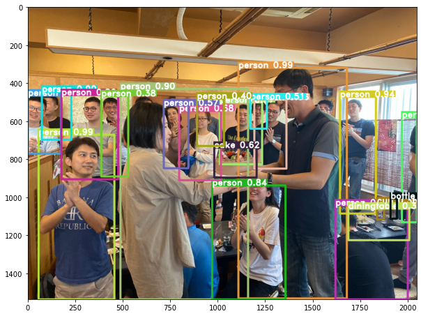

# yolo-v4-tf.keras
A simple tf.keras implementation of YOLO v4



## TODO

- [X] Cosine annealing scheduler
- [X] mAP
- [ ] Mosaic augmentation
- [ ] DropBlock
- [ ] Self-adversarial training (SAT)
- [ ] Label smoothing
- [X] Mish
- [X] IoU, GIoU, CIoU loss 
- [X] multi-GPU training


## Quick Start

1. Download official YOLO v4 pre-trained weights from [github/AlexeyAB/darknet](https://drive.google.com/open?id=1cewMfusmPjYWbrnuJRuKhPMwRe_b9PaT)
2. Initialize YOLO model and load weights
3. Run prediction

    Example: [Inference.ipynb](notebook/Inference.ipynb):
```python
from models import Yolov4
model = Yolov4(weight_path='yolov4.weights', 
               class_name_path='class_names/coco_classes.txt')
model.predict('input.jpg')
```
    
## Training

1. Generate your annotation files (.XML) in VOC format for each images

    *HINT:* An easily used annotation tool: [labelImg](https://github.com/tzutalin/labelImg)
    
    Example: A 2 object xml file
    ```xml
    <annotation>
        <folder>train_img2</folder>
        <filename>yui.jpg</filename>
        <path>/Users/taipingeric/dataset/train_img2/yui.jpg</path>
        <source>
            <database>Unknown</database>
        </source>
        <size>
            <width>465</width>
            <height>597</height>
            <depth>3</depth>
        </size>
        <segmented>0</segmented>
        <object>
            <name>person</name>
            <pose>Unspecified</pose>
            <truncated>1</truncated>
            <difficult>0</difficult>
            <bndbox>
                <xmin>43</xmin>
                <ymin>41</ymin>
                <xmax>430</xmax>
                <ymax>597</ymax>
            </bndbox>
        </object>
        <object>
            <name>person</name>
            <pose>Unspecified</pose>
            <truncated>1</truncated>
            <difficult>0</difficult>
            <bndbox>
                <xmin>60</xmin>
                <ymin>70</ymin>
                <xmax>20</xmax>
                <ymax>207</ymax>
            </bndbox>
        </object>
    </annotation>
    
    ```

2. Convert all XML files to a single .txt file: 

    Row format: `img_path BOX0 BOX1 BOX2 ...`
    
    BOX format: `xmin,ymin,xmax,ymax,class_id`
    
    Example: [xml_to_txt.py](xml_to_txt.py)
    ```
    img1.jpg 50,60,70,80,0 70,90,100,180,2
    img2.jpg 10,60,70,80,0
    ...
    ``` 

3. Generate class name file, # of lines == # of classes

    Example: [coco_classes.txt](class_names/coco_classes.txt)
    ```
    person
    bicycle
    car
    motorbike
    aeroplane
    bus
    ...
    ```
4. Train with the code below
    
    Example: [train.ipynb](notebook/train.ipynb)
```python

from utils import DataGenerator, read_annotation_lines
from models import Yolov4

train_lines, val_lines = read_annotation_lines('../dataset/txt/anno-test.txt', 
                                               test_size=0.1)
FOLDER_PATH = '../dataset/img'
class_name_path = '../class_names/bccd_classes.txt'
data_gen_train = DataGenerator(train_lines, 
                               class_name_path, 
                               FOLDER_PATH)
data_gen_val = DataGenerator(val_lines, 
                             class_name_path, 
                             FOLDER_PATH)

model = Yolov4(weight_path=None, 
               class_name_path=class_name_path)

model.fit(data_gen_train, 
          initial_epoch=0,
          epochs=10000, 
          val_data_gen=data_gen_val,
          callbacks=[])

```
   
## Acknowledgements


* [qqwweee/keras-yolo3](https://github.com/qqwweee/keras-yolo3)
* [AlexeyAB/darknet](https://github.com/AlexeyAB/darknet)
* [hunglc007/tensorflow-yolov4-tflite](https://github.com/hunglc007/tensorflow-yolov4-tflite)
* [Cartucho/mAP](https://github.com/Cartucho/mAP)
* [miemie2013/Keras-YOLOv4](https://github.com/miemie2013/Keras-YOLOv4)
* [david8862/keras-YOLOv3-model-set](https://github.com/david8862/keras-YOLOv3-model-set)
* [Ma-Dan/keras-yolo4](https://github.com/Ma-Dan/keras-yolo4)
